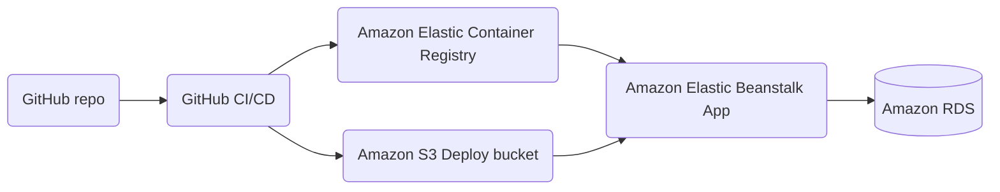

# Task Listing App deployed to AWS using Terraform insfrastuture

This repo contains an Angular and Express application that I used to create a CI/CD pipline using Terraform.

### Application Architecture

